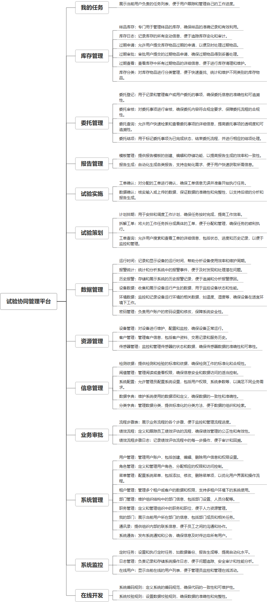

 

    
 

公司拥有上百套具有自主知识产权的软件系统，详情请查看码云首页或公司官网

 
<h1>试验协同管理平台</h1>

<a href="https://www.haishi.net.cn/">公司官网</a> ｜ <a href="https://www.haishi.net.cn/">在线体验</a>

 

## 系统介绍

 是一款集试验策划、实施、数据管理、报告生成等功能于一体的综合性平台。它通过阈值管理、系统配置等手段，确保试验数据的准确性和可靠性。平台还提供了客户管理、委托审核、报告编辑等模块，方便用户与客户进行高效协作。此外，平台还支持数据可视化、绩效考核等功能，帮助用户深入分析试验数据，
是一款集试验策划、实施、数据管理、报告生成等功能于一体的综合性平台。它通过阈值管理、系统配置等手段，确保试验数据的准确性和可靠性。平台还提供了客户管理、委托审核、报告编辑等模块，方便用户与客户进行高效协作。此外，平台还支持数据可视化、绩效考核等功能，帮助用户深入分析试验数据，
本项目名称为试验协同管理平台，是一款用于试验全流程管理的系统。该系统适用于各类实验室、研发机构等，旨在提高试验效率，规范试验流程，实现数据的协同管理。
本项目包含以下主要功能模块：
- 库存管理：对样品、试剂等进行入库、出库、库存预警等管理
- 委托管理：进行试验委托登记、审核、查询、结项等
- 试验策划：制定试验计划、拆解工单、查询工单进度等
- 试验实施：确认工单、记录试验数据等
- 报告管理：管理试验报告模板、生成试验报告等
- 数据管理：查看设备运行时间、报警统计、历史报警、设备数据、环境数据等
- 资源管理：管理设备、客户、传感器等信息
- 信息管理：管理检测依据、阈值、系统配置、数据字典、分类字典等
- 业务审批：自定义审批流程、查看审批进度等
- 系统管理：进行用户管理、角色管理、部门管理等
                

## 系统功能介绍

### 系统包含终端说明

管理端（WEB）

| 序号 | 模块 | 模块说明 |
| --- | --- | --- |

### 系统功能结构

### 系统功能说明

本项目包含多个功能，以下列举几个较为重要的功能：
1. 试验策划：该功能可以帮助用户制定详细的试验计划，并将其拆解成具体的工单，方便跟踪试验进度。
2. 数据管理：该功能可以实时监控设备运行状态，记录设备数据和环境数据，并提供报警统计和历史报警查询，保障试验安全。
3. 报告管理：该功能可以根据预设的模板自动生成试验报告，提高报告撰写效率，并方便对试验结果进行分析和管理。
4. 库存管理：该功能可以对试验所需的样品、试剂等进行精细化管理，避免资源浪费，提高试验效率。

## 系统主要界面

## 系统技术说明

### 代码模块说明

| 序号 | 目录 | 目录说明 |
| --- | --- | --- |

### 系统技术选型

#### 开发语言/框架

JAVA（JDK1.8）

#### 服务中间件

Nginx
Tomcat

#### 数据库

MySQL（5.7+）

#### 其他说明

无

## 系统演示/商用

请扫码添加客服微信获取演示地址和系统详细资料。

如果您想基于试验协同管理平台进行商业化交付或定制开发服务，我们提供有偿的技术服务支持，合作模式不限，欢迎沟通！

公司官网地址： <a href="https://www.haishi.net.cn/">https://www.haishi.net.cn</a>

联系客服获取专业回答。

## 使用须知

1、 本项目商用必须获得版权所有者的授权。

2、 未经允许本项目代码不允许二次出售。

